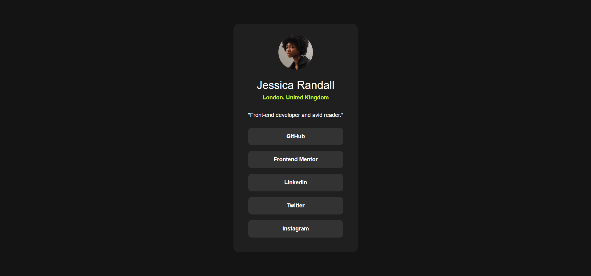

# Frontend Mentor - Social links profile solution

This is a solution to the [Social links profile challenge on Frontend Mentor](https://www.frontendmentor.io/challenges/social-links-profile-UG32l9m6dQ). Frontend Mentor challenges help you improve your coding skills by building realistic projects.

## Table of contents

## Overview

### The challenge

Users should be able to:

- See hover and focus states for all interactive elements on the page

### Screenshot

### Links

- Solution URL: [Add solution URL here](https://github.com/ayeniDan/social-links-profile-main)

- Live Site URL: [Add live site URL here](https://social-links-profile-main-gules.vercel.app/)

## My process

### Built with

- Semantic HTML5 markup
- CSS
- Flexbox
- Desktop-first workflow

### What I learned

I learnt alot on this project. I learnt how to use the min-height property in css. I also deployed on vercel for the first time.

### Continued development

I definitely want to focus on my use of CSS custom properties. I also want to work on writing better html markup. I'll also work on my use of version control.

### Useful resources

- [Youtube video](https://www.youtube.com/watch?v=JHWT_V9pYu8) - This helped me better understand the overall project. I watched it when I hit a stumbling block in the project and it gave me insight and breakthrough in the project.
- [Blogpost](https://codingtorque.com/how-to-deploy-html-css-javascript-website-on-vercel/) - This is an amazing article which helped me finally understand deployment using vercel. I'd recommend it to anyone still learning this concept.

## Author

- Frontend Mentor - [@ayeniDan](https://www.frontendmentor.io/profile/ayeniDan)
- Facebook - [Daniel Ayeni](https://web.facebook.com/profile.php?id=61555029605626)

## Acknowledgments

I want to give credit to my classrep (Treasure). He was the one who helped with the link that helped me understand deploying using Vercel
